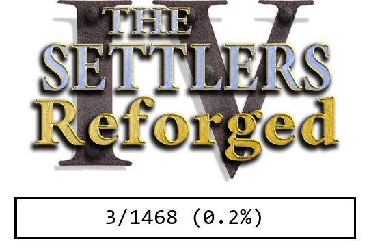

# S4Forge.RE
This repository is all about reverse engineering Settlers 4.

## Debug Symbols
There are custom made debug symbol files (`.pdb`) available for download in the the [S4_MainR Folder](S4_MainR) and [S4_MainD folder](S4_MainD).
The symbols come from either reverse engineering efforts or from the debug build that's been included in the History Edition.

## Decompilation
This repository also contains a decompilation project of Settlers 4 into C++ code.

### Current progress

See [Decompilation/PROGRESS.md](Decompilation/PROGRESS.md) for more detailed information about the current decompilation progress.